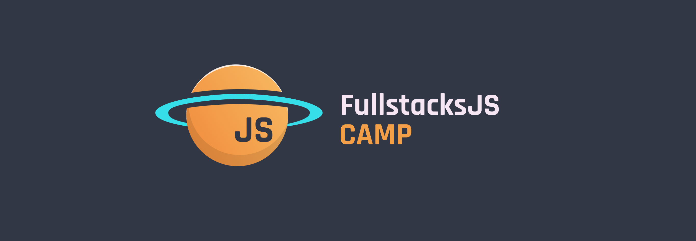

[← Parent](./README.md)

## What is CAMP

FullstacksJS CAMP is a 3-month online event with the objective of getting real-world working environment experience as well as working in variety roles in a software team.

## Who can benefit from CAMP

This CAMP can act as a real job, making it beneficial for those who wish to experience real-world working challenges and processes.

## What’s going to happen in CAMP

In CAMP, we work as a software team on open-source projects that provide a wide range of challenges. The projects by itself is not the goal, the primary purpose is to gain experience and develop both hard-skills and soft-skills. Nevertheless, community or other non-profit clients may utilize the projects.

- You’ll experience working as in an All-English working environment.
- You’ll gain experience of Agile values and principles.
- You’ll continue to learn how to design, develop, and ship a scaleable software.

## Must Have

- Written and verbal communication skills (Limited Working  Proficiency).
- Enthusiasm to learn and grow.
- Commitment to work.

## Schedule

- 4 hours a day / 5 days a week
- You should be available for daily and weekly  .
 - Daily stand-up (15 minute /  )
 - Grooming session (1 hour /  )
 - Demo (1 hour /  )
 - Retrospective (30 minutes /  )
 - Sprint planning (30 minutes / cycle)

## We work closely with

- HTML/CSS
- Typescript
- ReactJS
- NodeJS/Deno

## How to apply?

Send your resume in **English** to [FullstacksJS@gmail.com](mailto:fullstacksjs@gmail.com "mailto:fullstacksjs@gmail.com").
