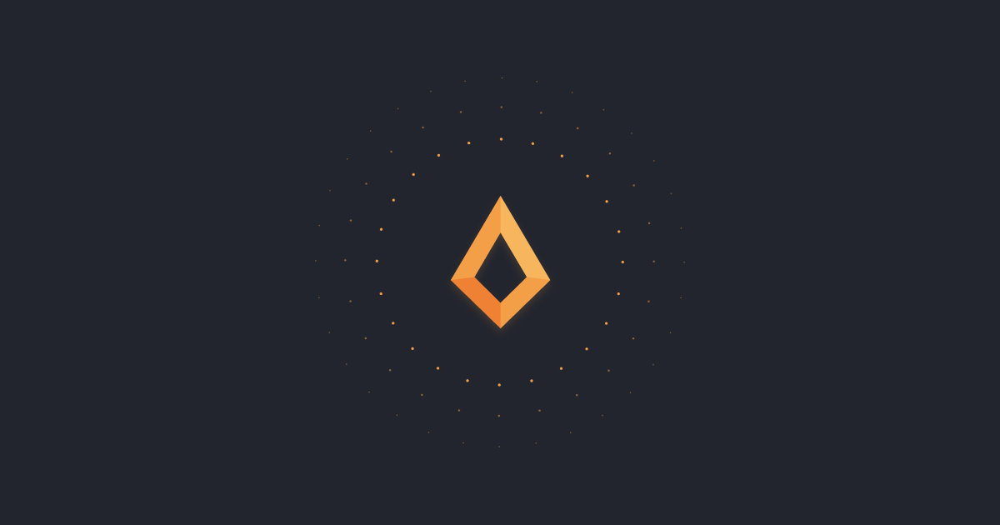

<h1 lang="fa" dir="rtl" align="right">FullstacksJS</h1>

<h2 lang="fa" dir="rtl" align="right">درباره جامعه</h2>

ما یک جامعه در حوزه‌ی برنامه‌نویسی و مهندسی نرم‌افزار با هدف یادگیری هستیم.
هدف اصلی این جامعه ایجاد بستری حرفه‌ای برای یادگیری عمیق مفاهیم در حوزه توسعه و مهندسی نرم‌افزار است.
از سری برنامه‌های ما در این جامعه پرسش و پاسخ توسط منتورها، برگزاری میت‌آپ‌ها، لایوها و تولید دوره‌های آموزشی هست.
همچنین در راستای یادگیری و تقویت فرهنگِ توسعه و مشارکت متن‌ باز،‌ پروژه‌هایی که در این جامعه توسعه داده می‌شود، کاملا متن باز بوده و اعضا می‌توانند در آن‌ها مشارکت داشته باشند.

<h2 lang="fa" dir="rtl" align="right">چشم انداز</h2>
<blockquote lang="fa" dir="rtl">با هم رشد می‌کنیم</blockquote>

<h2 lang="fa" dir="rtl" align="right">اهداف و انگیزه شکل‌گیری</h2>

محیط اینترنت از محتوا، آموزش‌ها و انجمن‌های برنامه‌نویسی نظارت نشده‌ای اشباع شده است.
این انجمن‌ها با هدف کسب شهرت یا برندسازی شخصی، اطلاعات ناقص، منسوخ شده و گاها اشتباهی را به جویندگان دانش این حوزه منتقل می‌کنند.
از این رو، تصمیم گرفتیم تا بستری ایجاد نماییم که محتوا و فعالیت‌های آن توسط افراد متخصص مدیریت و نظارت شود.

<h2 lang="fa" dir="rtl" align="right">ارزش‌های ما</h2>

ارزش‌ها به جامعه ما شکل می‌دهند و مشخص کننده مسیر حرکت و تصمیمات جامعه می‌باشند.
تصمیم‌ها و فرم محتوای تولید شده در جامعه به صورت مستقیم از این ارزش‌ها تاثیر می‌پذیرند.

<ol dir="rtl">
  <li>
    <strong>:اخلاق</strong>
    
مهم‌ترن ارزش در جامعه که بالاترین الویت را در تصمیمات دارا می‌باشد. در جامعه هیچگاه ارزش‌های اخلاقی بخاطر منافع حاصل از فعالیت‌ها کنار گذاشته نمی‌شوند.

  </li>
  <li>
    <strong>صحت اطلاعات و محتوای تولید شده:</strong>
    
محتوایی که در جامعه تولید یا توسط جامعه تایید و بازنشر داده می‌شوند، باید توسط افراد متخصص اعتبارسنجی شده باشند. اگر پس از نشر محتوا متوجه اشتباه بودن مطالب شویم باید اشتباه بودن آن را اطلاع رسانی کرده و محتوای تصحیح کند.

  </li>
</ol>

## شبکه‌های مجازی

- [وبسایت](https://fullstacksjs.com)
- [تلگرام](https://t.me/fullstacks)
- [یوتیوب](https://youtube.com/@FullstacksJS)
- [لینکدین](https://linkedin.com/company/fullstacksjs/)
- [دیسکورد](https://kutt.it/fsk-discord)
- [توئیتچ](https://twitch.tv/fullstacksjs)
- [گیت‌هاب](https://github.com/fullstacksjs)
- [توئیتر](https://twitter.com/fullstacksjs)

